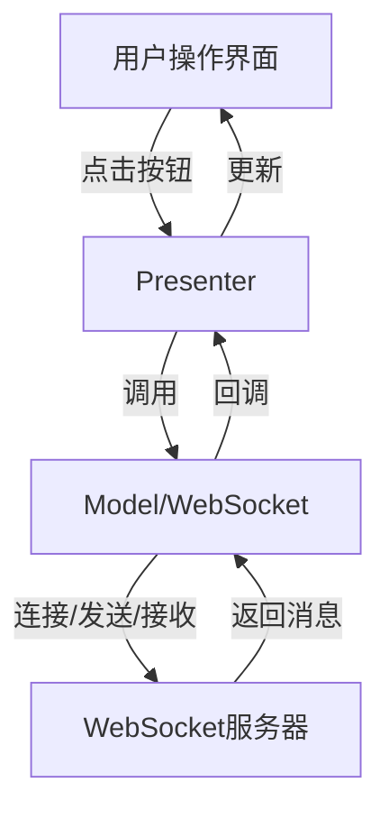

# WebSocket(MVP)

## 接口层

```kotlin
interface WebSocketContract {

    interface View {
        fun showConnectionStatus(connected: Boolean)
        fun showMessage(message: String)v 
    }

    interface Presenter {
        fun connect()
        fun disconnect()
        fun sendMessage(message: String)
        fun onDestroy()
    }

    interface Model {
        fun connect(listener: WebSocketListener)
        fun disconnect()
        fun sendMessage(message: String): Boolean
    }
}
```

这段代码中为M层、V层和P层定义好了接口类。

## M层

```kotlin
class WebSocketModel : WebSocketContract.Model {

    private var webSocket : WebSocket?=null
    private val client by lazy {
        OkHttpClient.Builder()
            .pingInterval(30, TimeUnit.SECONDS)
            .build()
    }

    override fun connect(listener: WebSocketListener) {
        val request = okhttp3.Request.Builder()
            .url("wss://echo.websocket.events") 
            .build()
	//创建WebSocket请求，指定服务器地址
        webSocket = client.newWebSocket(request, listener)
    }
	//用OkHttp的newWebSocket方法建立连接，传入监听器
    override fun disconnect() {
        webSocket?.close(1000, "Normal closure")
        client.dispatcher.executorService.shutdown()
        webSocket = null
    }

    override fun sendMessage(message: String): Boolean {
        return webSocket?.send(message) ?: false
    }
}
```

M层负责与WebSocket服务器获得连接，通过OkHttp地WebSocket API实现连接、发送信息

## V层

```kotlin
class WebSocketActivity : AppCompatActivity(), WebSocketContract.View {

    private lateinit var binding : ActivityWebsocketBinding
    private lateinit var presenter: WebSocketContract.Presenter

    override fun onCreate(savedInstanceState: Bundle?) {
        super.onCreate(savedInstanceState)
        binding = ActivityWebsocketBinding.inflate(layoutInflater)
        setContentView(binding.root)
        presenter = WebSocketPresenter(this, WebSocketModel())
        setupUI()
    }

    private fun setupUI() {
        binding.connectButton.setOnClickListener {
            presenter.connect()
        }

        binding.disconnectButton.setOnClickListener {
            presenter.disconnect()
        }

        binding.sendButton.setOnClickListener {
            val message = binding.messageEditText.text.toString()
            presenter.sendMessage(message)
            binding.messageEditText.text.clear()
        }
    }

    override fun showConnectionStatus(connected: Boolean) {
        runOnUiThread {
            binding.connectionStatus.text = if(connected) "Connected" else "Disconnected"
            binding.connectButton.isEnabled = !connected
            binding.disconnectButton.isEnabled = connected
            binding.sendButton.isEnabled = connected
        }
    }

    override fun showMessage(message: String) {
        runOnUiThread {
            binding.messagesTextView.append("$message\n")
        }
    }

    override fun showError(error: String) {
        runOnUiThread {
            binding.messagesTextView.append("Error: $error\n")
        }
    }

    override fun onDestroy() {
        super.onDestroy()
        presenter.onDestroy()
    }
}
```

V层负责界面显示和用户交互。一是通过三个方法更新UI状态，二是为按钮注册点击事件，触发presenter层的逻辑。

## P层

```kotlin
class WebSocketPresenter(
    private val view : WebSocketContract.View,
    private val model : WebSocketContract.Model
) : WebSocketContract.Presenter {

    private val webSocketListener = object : WebSocketListener() {
        override fun onOpen(webSocket: WebSocket, response: okhttp3.Response) {
            view.showConnectionStatus(true)
            view.showMessage("Connected to WebSocket server")
        }

        override fun onMessage(webSocket: WebSocket, text: String) {
            view.showMessage("Sent $text")
            view.showMessage("Received $text")
        }

        override fun onClosing(webSocket: WebSocket, code: Int, reason: String) {
            view.showMessage("Closing: $code / $reason")
        }

        override fun onFailure(webSocket: WebSocket, t: Throwable, response: okhttp3.Response?) {
            view.showError("Error: ${t.message}")
            view.showConnectionStatus(false)
        }

        override fun onClosed(webSocket: WebSocket, code: Int, reason: String) {
            view.showConnectionStatus(false)
            view.showMessage("Closing: $code / $reason")
        }
    }

    override fun connect() {
        model.connect(webSocketListener)
    }

    override fun disconnect() {
        model.disconnect()
    }

    override fun sendMessage(message: String) {
        if (message.isNotEmpty()) {
            val success = model.sendMessage(message)
            if (!success) {
                view.showError("Failed to send message - not connected")
            }
        }
    }

    override fun onDestroy() {
        disconnect()
    }
}
```

P层负责处理界面事件和业务逻辑，连接WebSocket和发送消息

# AndroidStudio中使用WebSocket的完整流程

## 1.添加依赖

```kotlin
implementation("com.squareup.okhttp3:okhttp:4.12.0")
```

在build.gradle里添加OkHttp依赖。

## 2.创建WebSocket客户端

使用OkHttpClient创建WebSocket连接；实现WebSocket处理连接、消息、关闭、异常等事件。

## 3.发送和接收消息

通过webSocket.send()发送消息，在onMessage回调中处理服务器返回的数据

## 4.UI线程安全

Android UI只能在主线程更新，收到消息后用runOnUiThread更新界面

## 5.断开连接和资源释放

调用webSocket.close()断开连接；在Activity的onDestroy里释放资源，防止内存泄漏

# 注意问题

1.调试时多使用Logcat打印日志，方便定位问题

2.UI相关操作必须在主线程进行，否则不会生效




